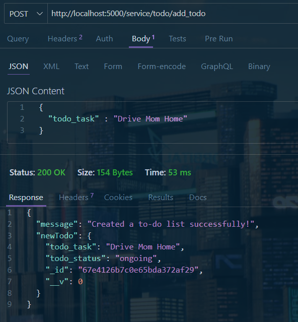
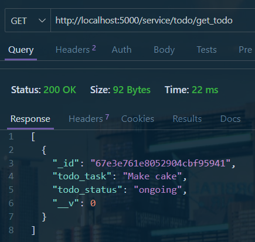
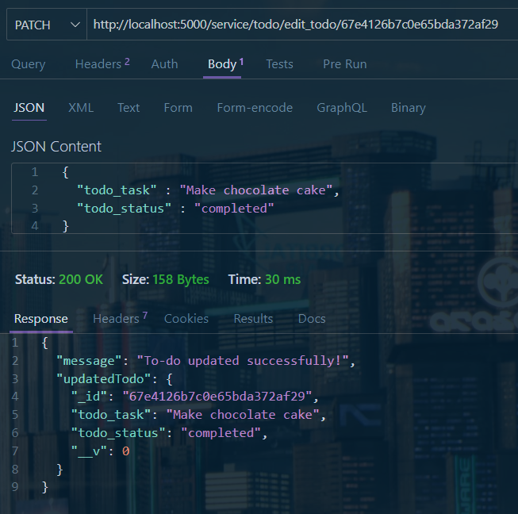
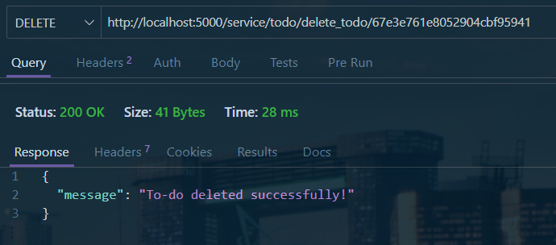

# HelpSOS Web App
HelpSOS is a web application that I made just for fun just to try out a couple new things I wanted to try. The SOS part stands for 'Study Organization Software'. I specificly call this an SOS and added a 'Help' tag into it because I'm referencing how people always try to send a message with 'SOS' when asking for urgent help. I add this because organizing studies can be something students dont normally consider and end up stranded, leading them to ask for help even though they made themselves lost by not organizing their studies. So, I made this web app with that name to help other students like me to study a little bit easier by utilizing the tools provided in this website

# MongoDB API Request tests

